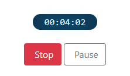

# dn-timer
A pausable Javascript timer that is designed to survive hibernation mode and will resume when the device wakes up.



## The problem

Have you ever played with the [Google Stopwatch](https://www.google.com/search?q=stopwatch) and wondered at its simplicity?   I did.

It wasn't until I needed a timer for my own website that I started to think more deeply about the design.

On the surface, running a timer seems like a fairly simple thing to do.  The following piece of Rxjs code creates a new Observable and emits the seconds:

```
const source = interval(1000);

this.timer$ = source.pipe(
    takeUntil(this.stop$)
).subscribe(e => {
    this.tick$.next(e);
});
```

The issue here is that, while this might work fine in a browser on your laptop, it won't maintain the time if it is running on a device which goes into hibernation - e.g. an iPad.

To get around this, it is possible to take a snapshot of the Time when the timer is started, and on each subsequent tick, calculate the elapsed time.  That way, even when the device resumes from its sleep, it will still be able to accurately keep track of the elapsed time.

## Pausing the timer

I wanted a way to be able to pause and continue the timer without having the elapsed time include any paused time.

The following diagram depicts a timer that is run for 5 seconds, paused for 5 seconds, and then run for a further 5 seconds.

```
o-------->          o--------->

0        5          10        15
```

In this case, I want the timer to show 10 seconds elapsed.  To do this, the pausable timer maintains a second timer to keep track of paused time and adds it to a `totalPausedTime` count.

```
o-------->ppppppppppo--------->ppppppppppo--------->

0        5          10        15        20         25
```

In the case of the second diagram, our calculation for working out elapsed time would look something like this:

```javascript
const startingTime = 0;  
let totalPausedTime = 10;
let timeSinceStart = 25; // 25 - 0
let elapsedTime = 15 // timeSinceStart - totalPausedTime
```

## Run the demo

The project is built using Webpack to output a bundle that is consumed by the `index.html` page

```
> npm run build:webpack
```

To run the sample, I install and run the [webpack-dev-server](https://github.com/webpack/webpack-dev-server)

```
> npm install webpack-dev-server -g
> webpack-dev-server
 ```